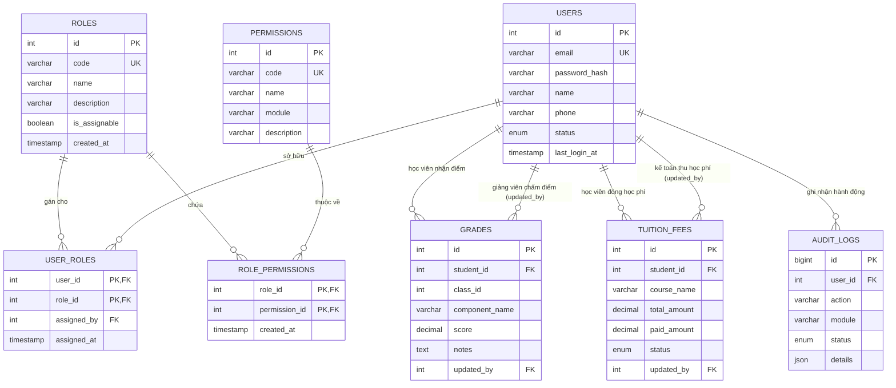

# TÀI LIỆU THIẾT KẾ CƠ SỞ DỮ LIỆU - PHÂN HỆ PHÂN QUYỀN VAI TRÒ (RBAC)

> **Mã công việc Jira:** `IDTTX-39` [BE] Thiết kế Database  
> **Thuộc User Story:** `IDTTX-20` (Phân quyền theo vai trò cho toàn hệ thống)  
> **Người thực hiện:** Nguyễn Minh Ngọc (MN) - `nguyenminhngoc482006@gmail.com`  
> **Chuẩn hóa dữ liệu:** Đạt chuẩn 3NF (Third Normal Form)  
> **Hệ quản trị CSDL mục tiêu:** MySQL 8.0+ / PostgreSQL 14+  

---

## 1. Mục tiêu và Phạm vi thiết kế
Thiết kế CSDL phục vụ cơ chế kiểm soát truy cập dựa trên vai trò (Role-Based Access Control - RBAC) và giải quyết trọn vẹn yêu cầu nghiệp vụ của Story `IDTTX-20`:
1. Quản lý **8 vai trò nghiệp vụ** trong toàn bộ hệ thống.
2. Thiết lập quan hệ nhiều-nhiều giữa Người dùng - Vai trò và Vai trò - Quyền hạn.
3. Phân tách rành mạch quyền hạn giữa các bộ phận:
   - **Giảng viên (Instructor):** Có quyền xem và chỉnh sửa điểm số học viên (`GRADE_EDIT`), nhưng **tuyệt đối không có quyền chỉnh sửa học phí (`TUITION_EDIT`)**.
   - **Kế toán (Accountant):** Có quyền xem và chỉnh sửa/ghi nhận học phí (`TUITION_EDIT`), nhưng **tuyệt đối không có quyền chỉnh sửa điểm số học viên (`GRADE_EDIT`)**.
   - **Quản trị hệ thống (Admin):** Toàn quyền kiểm soát tài khoản và phân quyền.
   - **Học viên (Student):** Chỉ có quyền tra cứu (Read-only) dữ liệu liên quan đến bản thân.

---

## 2. Sơ đồ thực thể liên kết (Entity Relationship Diagram - ERD)

---

## 3. Phân tích tuân thủ Chuẩn hóa 3NF (Third Normal Form)

Mô hình dữ liệu được thiết kế tuân thủ nghiêm ngặt chuẩn hóa dữ liệu:

1. **Chuẩn 1NF (First Normal Form - Tính nguyên tử):**
   - Mọi thuộc tính trong tất cả các bảng đều là giá trị đơn nguyên tử (Atomic values), không chứa danh sách lồng ghép.
   - Không lưu chuỗi danh sách vai trò dạng `"Admin,Instructor"` trong bảng `users`, mà tách riêng thành bảng liên kết `user_roles`.

2. **Chuẩn 2NF (Second Normal Form - Không phụ thuộc một phần):**
   - Đã đạt 1NF.
   - Các bảng có khóa chính tổng hợp (`user_roles` với khóa `(user_id, role_id)` và `role_permissions` với khóa `(role_id, permission_id)`) không chứa thuộc tính nào phụ thuộc vào một phần của khóa chính. `assigned_at` và `assigned_by` phụ thuộc vào toàn bộ cặp `(user_id, role_id)`.

3. **Chuẩn 3NF (Third Normal Form - Không phụ thuộc bắc cầu):**
   - Đã đạt 2NF.
   - Không tồn tại phụ thuộc hàm bắc cầu $X \rightarrow Y \rightarrow Z$ giữa các thuộc tính không khóa.
   - Ví dụ: Thông tin mô tả vai trò (`name`, `description`) được lưu duy nhất tại bảng `roles`, không lặp lại trong `user_roles` hay `users`. Khi vai trò đổi tên, chỉ cần cập nhật một dòng duy nhất tại `roles`.

---

## 4. Ma trận phân quyền theo 12 Module (Chuẩn tài liệu User Roles & IDTTX-20)

### 4.1. Quy ước ký hiệu phân quyền (Permission Legend)
- **`F` (Full / Toàn quyền)**: Có quyền toàn diện trên module (Xem, Thêm mới, Chỉnh sửa, Xóa, Cấu hình, Duyệt).
- **`W` (Write / Ghi trong phạm vi)**: Được ghi, sửa, chấm bài, điểm danh trong phạm vi được phân công/giao phó.
- **`R` (Read / Chỉ xem)**: Chỉ được xem dữ liệu, không có quyền chỉnh sửa.
- **`–` (None / Không truy cập)**: Không có quyền truy cập vào phân hệ (từ chối ngay từ menu và filter 403 ở tầng server).
- **`*` (Scope Constraint / Ràng buộc phạm vi)**: Chỉ thao tác trên dữ liệu của **chính mình** hoặc của **lớp mình trực tiếp phụ trách**. Đây là **ràng buộc bắt buộc kiểm tra ở tầng server**, không phải quy ước giao diện.
- **`Admin`**: Có toàn quyền (`F`) trên mọi module của hệ thống.

---

### 4.2. Bảng Ma trận phân quyền chi tiết theo 12 Module nghiệp vụ

| STT | Phân hệ / Module nghiệp vụ | Student (Học viên) | TA (Trợ giảng) | Instructor (Giảng viên) | Admissions (Tuyển sinh) | Accountant (Kế toán) | Training Mgr (QL Đào tạo) | Admin (Quản trị) |
|:---:|:---|:---:|:---:|:---:|:---:|:---:|:---:|:---:|
| 1 | **Chương trình & môn học** | `R` | `R` | `R` | `R` | `–` | `F` | `F` |
| 2 | **Tuyển sinh & lead** | `–` | `–` | `–` | `F` | `R` | `R` | `F` |
| 3 | **Hồ sơ học viên** | `W*` | `R` | `R` | `W` | `R` | `F` | `F` |
| 4 | **Lớp học & thời khoá biểu** | `R*` | `R` | `R` | `R` | `–` | `F` | `F` |
| 5 | **Điểm danh** | `R*` | `W` | `W` | `–` | `–` | `F` | `F` |
| 6 | **Học liệu & thông báo lớp** | `R*` | `W*` | `W*` | `–` | `–` | `F` | `F` |
| 7 | **Bài tập & chấm điểm** | `W*` | `W` | `F` | `–` | `–` | `R` | `F` |
| 8 | **Điểm tổng kết & tốt nghiệp** | `R*` | `R` | `W` | `–` | `–` | `F` | `F` |
| 9 | **Học phí & công nợ** | `R*` | `–` | `–` | `R` | `F` | `R` | `F` |
| 10 | **Khảo sát chất lượng** | `W*` | `–` | `R*` | `–` | `–` | `F` | `F` |
| 11 | **Báo cáo & dashboard** | `–` | `–` | `R*` | `R*` | `R*` | `F` | `F` |
| 12 | **Người dùng & nhật ký** | `–` | `–` | `–` | `–` | `–` | `R` | `F` |

---

### 4.3. Điểm kiểm chứng cốt lõi của Story IDTTX-20 & S1-05
1. **Giảng viên (`Instructor`)**:
   - Module `Bài tập & chấm điểm`: **`F`** (Toàn quyền quản lý bài tập & chấm điểm lớp dạy).
   - Module `Điểm tổng kết & tốt nghiệp`: **`W`** (CÓ quyền nhập/sửa điểm tổng kết lớp phụ trách).
   - Module `Học phí & công nợ`: **`–`** (Tuyệt đối **KHÔNG CÓ QUYỀN** xem hoặc sửa học phí).
2. **Kế toán (`Accountant`)**:
   - Module `Học phí & công nợ`: **`F`** (Toàn quyền ghi nhận thanh toán, theo dõi công nợ, xuất báo cáo).
   - Module `Bài tập & chấm điểm` & `Điểm tổng kết`: **`–`** (Tuyệt đối **KHÔNG CÓ QUYỀN** chỉnh sửa điểm số học viên).
3. **Quản trị hệ thống (`Admin`)**:
   - Toàn quyền **`F`** trên toàn bộ 12 module của hệ thống.
4. **Học viên (`Student`)**:
   - Chỉ được xem (`R*`) và nộp bài/cập nhật hồ sơ của chính mình (`W*`). Tuyệt đối không xem được dữ liệu của học viên khác.

---

## 5. Danh mục bảng dữ liệu chi tiết (Data Dictionary)

### 5.1. Bảng `roles` (Vai trò)
- `id` (INT, PK, Auto Increment): Khóa chính.
- `code` (VARCHAR(50), UNIQUE, NOT NULL): Mã vai trò chuẩn (`Admin`, `Instructor`, `Accountant`,...).
- `name` (VARCHAR(100), NOT NULL): Tên hiển thị tiếng Việt.
- `description` (VARCHAR(255)): Mô tả quyền hạn.
- `is_assignable` (BOOLEAN, DEFAULT TRUE): Cờ cho biết vai trò có gán được cho user hay không (`FALSE` với `Guest`).

### 5.2. Bảng `users` (Người dùng)
- `id` (INT, PK, Auto Increment): Khóa chính.
- `email` (VARCHAR(150), UNIQUE, NOT NULL): Email định danh đăng nhập.
- `password_hash` (VARCHAR(255), NOT NULL): Mật khẩu băm (scrypt/bcrypt).
- `name` (VARCHAR(100), NOT NULL): Họ tên.
- `phone` (VARCHAR(20)): Điện thoại.
- `status` (ENUM('active', 'inactive', 'locked'), DEFAULT 'active'): Trạng thái.

### 5.3. Bảng `user_roles` (Phân quyền người dùng - vai trò)
- `user_id` (INT, FK -> users.id, PK): ID người dùng.
- `role_id` (INT, FK -> roles.id, PK): ID vai trò.
- `assigned_by` (INT, FK -> users.id): Người thực hiện phân quyền.
- `assigned_at` (TIMESTAMP): Thời điểm phân quyền.

### 5.4. Bảng `permissions` (Quyền hạn chi tiết)
- `id` (INT, PK, Auto Increment): Khóa chính.
- `code` (VARCHAR(100), UNIQUE, NOT NULL): Mã quyền (`GRADE_EDIT`, `TUITION_EDIT`,...).
- `name` (VARCHAR(150), NOT NULL): Tên quyền tiếng Việt.
- `module` (VARCHAR(50), NOT NULL): Phân hệ chức năng.

### 5.5. Bảng `role_permissions` (Gán quyền cho vai trò)
- `role_id` (INT, FK -> roles.id, PK): ID vai trò.
- `permission_id` (INT, FK -> permissions.id, PK): ID quyền.

### 5.6. Bảng `grades` (Điểm số)
- `id` (INT, PK, Auto Increment): Khóa chính.
- `student_id` (INT, FK -> users.id): ID học viên.
- `class_id` (INT): Lớp học.
- `component_name` (VARCHAR(100)): Tên đầu điểm.
- `score` (DECIMAL(4,2)): Điểm số (0.00 -> 10.00).
- `updated_by` (INT, FK -> users.id): ID người cập nhật điểm (Bắt buộc phải có quyền `GRADE_EDIT`).

### 5.7. Bảng `tuition_fees` (Học phí)
- `id` (INT, PK, Auto Increment): Khóa chính.
- `student_id` (INT, FK -> users.id): ID học viên.
- `course_name` (VARCHAR(150)): Tên học phần/khóa học.
- `total_amount` (DECIMAL(12,2)): Học phí cần đóng.
- `paid_amount` (DECIMAL(12,2)): Số tiền đã đóng.
- `status` (ENUM('unpaid', 'partially_paid', 'paid')): Trạng thái.
- `updated_by` (INT, FK -> users.id): ID người cập nhật học phí (Bắt buộc phải có quyền `TUITION_EDIT`).

---

## 6. Chiến lược chỉ mục (Indexing) và Ràng buộc toàn vẹn
- **Indexes:**
  - `idx_users_email` trên `users(email)`: Tăng tốc truy vấn xác thực đăng nhập $O(1)$.
  - `idx_user_roles_user` trên `user_roles(user_id)`: Nạp toàn bộ vai trò của user tức thì trong middleware xác thực.
  - `idx_role_permissions_role` trên `role_permissions(role_id)`: Kiểm tra quyền tức thì khi phân quyền theo vai trò.
- **Ràng buộc Foreign Keys:**
  - `ON DELETE CASCADE` cho quan hệ phụ thuộc chặt chẽ (`user_roles`, `role_permissions`).
  - `ON DELETE RESTRICT` cho quan hệ lịch sử/dữ liệu nghiệp vụ (`grades.updated_by`, `tuition_fees.updated_by`) để đảm bảo tính minh bạch kiểm toán (Audit Trail), ngăn chặn việc xóa tài khoản làm hỏng dữ liệu điểm số và tài chính.
